# Finly

Finly is a self-hosted, privacy-first personal finance and wealth management progressive web application (PWA). It combines direct bank synchronization, envelope budgeting, real-time net worth tracking, cashflow analysis, and savings goal management within a minimalist dark-mode interface inspired by Apple and Linear.

<p align="center">
  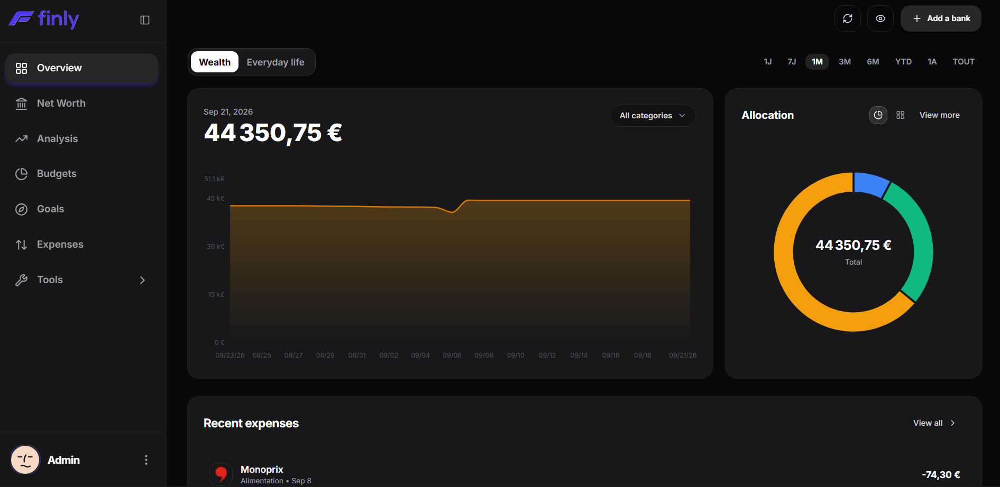
</p>

---

## Table of Contents

- [Overview](#overview)
- [Interface Gallery](#interface-gallery)
- [Key Features](#key-features)
- [Technology Stack](#technology-stack)
- [Prerequisites](#prerequisites)
- [Quick Start with Docker](#quick-start-with-docker)
- [Manual Development Setup](#manual-development-setup)
  - [FastAPI Backend](#fastapi-backend)
  - [Next.js Frontend](#nextjs-frontend)
- [Testing and Quality Assurance](#testing-and-quality-assurance)
- [Woob Bank Connectors Management](#woob-bank-connectors-management)
- [CLI Administration Tools](#cli-administration-tools)
- [Security and Data Protection](#security-and-data-protection)
- [Project Structure](#project-structure)
- [Contributing Guide](#contributing-guide)
- [License](#license)

---

## Overview

Finly is built for individuals who want complete sovereignty and control over their personal financial data without relying on third-party SaaS platforms or external cloud aggregation services.

- **100% Self-Hosted & Private:** All account details, bank credentials, and transaction histories remain strictly stored inside your local database.
- **Direct Bank Synchronization:** Automated retrieval of balances and operations powered by the open-source Woob engine, without paid intermediaries or remote telemetry.
- **Minimalist Aesthetic:** Exclusive Dark Mode UI (Zinc 950 `#09090B`), designed to highlight essential key metrics, charts, and actionable insights without superfluous clutter.
- **Responsive PWA:** Tailored experience across desktop screens, tablets, and mobile devices with dedicated bottom-bar navigation and native gesture feel.

---

## Interface Gallery

### Overview and Net Worth Dashboard

Centralized dashboard aggregating total net worth, asset distribution (checking accounts, savings, investments, real estate), historical trajectory, and one-click privacy masking.

| Desktop Version | Mobile Version |
| :--- | :--- |
|  | 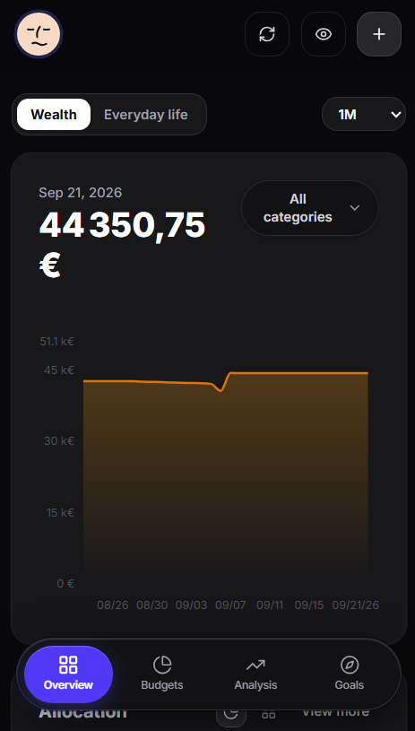 |

---

### Expenses and Transactions

Comprehensive transaction ledger with date filtering (day, month, custom range), search, auto-categorization rules, and side-sheet transaction inspector.

| Transactions Ledger |
| :--- |
| 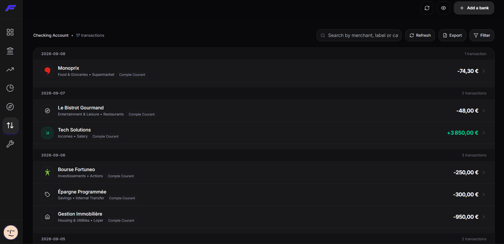 |

---

### Financial Analysis and Insights

In-depth spending breakdowns by category, merchant analysis, and comparative historical trends.

| Desktop Analysis | Mobile Analysis |
| :--- | :--- |
| 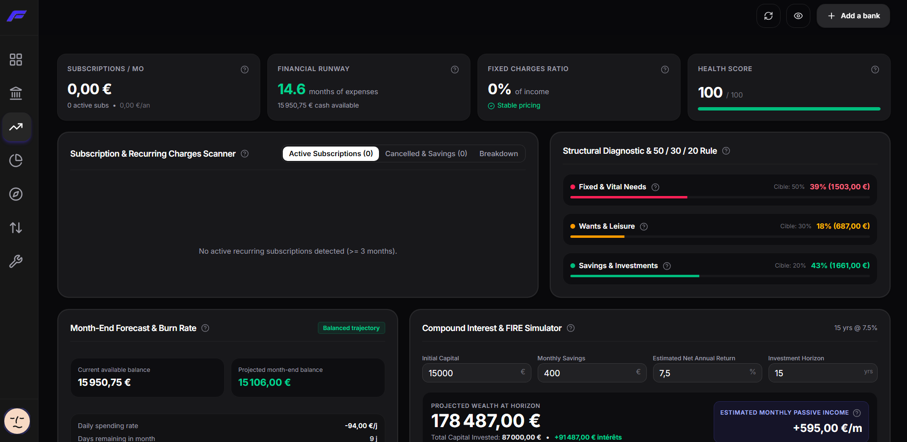 | 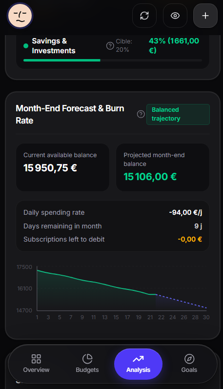 |

---

### Envelope Budgeting and Cashflow

Define spending caps per expense category with visual progress gauges and monitor monthly inflows versus outflows.

| Envelope Budgeting | Cashflow Analysis |
| :--- | :--- |
| 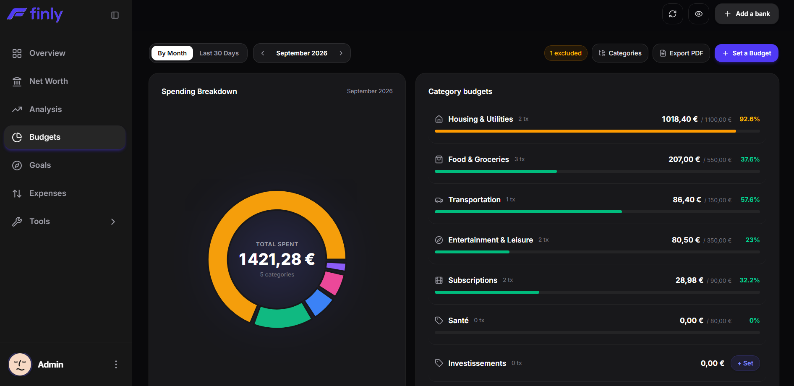 | 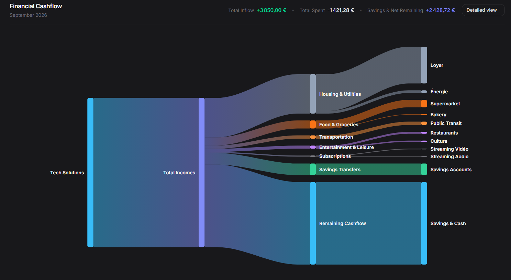 |

---

### Mobile Budgeting and Savings Goals

Track envelope consumption and target savings milestones on mobile.

| Mobile Budget | Mobile Savings Goals |
| :--- | :--- |
| 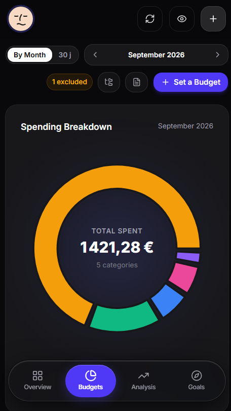 | 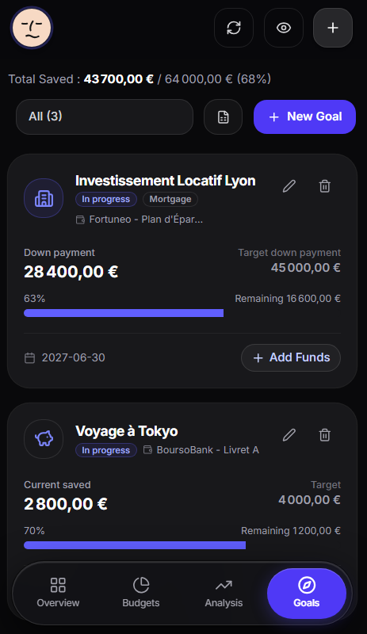 |

---

### Savings Goals and Settings

Set multi-stage savings targets with deadlines and configure direct bank connections.

| Savings Goals & Projects | Bank Connections & Settings |
| :--- | :--- |
| 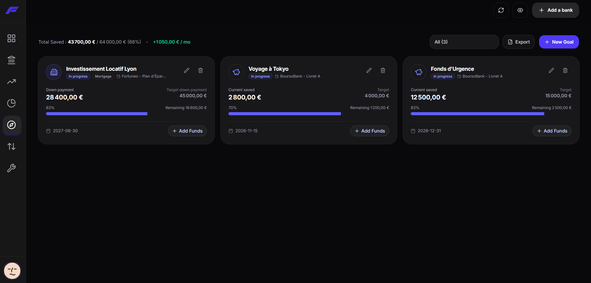 | 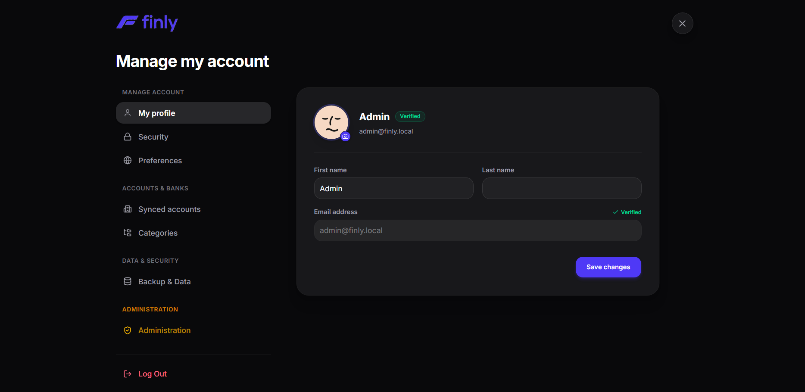 |

---

## Key Features

### 1. Net Worth & Asset Tracking
- Real-time aggregation of total net worth across multiple institutions.
- Comprehensive asset support: checking accounts, savings books, investment portfolios, and real estate properties (property value and remaining mortgage balance).
- Privacy Mode: Mask all monetary figures with a single click without altering interface layouts.
- Historical net worth evolution and trajectory charts.

### 2. Envelope Budgeting
- Configurable budget envelopes per category (Housing, Food, Transport, Leisure, Subscriptions, etc.).
- Real-time gauge consumption and visual overflow warnings.
- Structured monthly budget PDF export with breakdown charts.

### 3. Transaction Normalization & Categorization
- Automated merchant name cleaning and raw statement label normalization.
- Keyword-based dynamic rule engine for automatic categorization.
- Side drawer for rapid inspection, notes, category updates, and project assignment.

### 4. Savings Goals & Financial Projects
- Goal creation with target amount, target completion date, and visual progress meters.
- Remaining amount calculation and completed milestones tracking.

### 5. Local Bank Aggregation Engine (Woob)
- Direct integration with French and European banking institutions.
- AES-256 symmetric encryption (Fernet) for all stored credentials and session tokens.
- Integrated background scheduler (APScheduler) for automated periodic syncs.

### 6. Advanced Excel and PDF Exports
- Multi-tab Excel workbook (`.xlsx`) generation with native spreadsheet formulas (`SUM`, `SUMIF`).
- Formatted PDF budget and summary reports.

### 7. Administration & Maintenance Panel
- Dedicated `/admin` dashboard with system metrics (user count, active bank links, SQLite database size, background scheduler health).
- Complete user management: activation, password resets, and cascade account deletion.
- Admin Impersonation Mode for immediate diagnostics of user environments.
- Database maintenance utilities: forced global sync and database compaction (`VACUUM`).

---

## Technology Stack

### Frontend
- **Framework:** Next.js 16 (App Router, React 19, TypeScript)
- **Styling:** Tailwind CSS, Shadcn UI, Radix UI primitives
- **Data Visualization:** Recharts, Lucide Icons
- **Export Engines:** xlsx, xlsx-js-style, jspdf

### Backend
- **API Framework:** FastAPI (Python 3.11+)
- **Database:** SQLite with SQLAlchemy ORM
- **Authentication:** JWT (JSON Web Tokens) with bcrypt password hashing
- **Data Encryption:** Cryptography (AES-256 Fernet)
- **Banking Engine:** Woob (Web Outside of Browsers)
- **Background Tasks:** APScheduler

### Deployment & Tooling
- **Containerization:** Docker, Docker Compose
- **Testing:** Pytest (backend), Vitest & Testing Library (frontend)

---

## Prerequisites

- **Docker Approach (Recommended):**
  - Docker Engine 20.10+
  - Docker Compose 2.0+
- **Manual Development Approach:**
  - Node.js 20+ and npm
  - Python 3.11+ and pip

---

## Quick Start with Docker

The fastest and most reliable way to run Finly on a local machine or home server.

### 1. Clone the repository
```bash
git clone https://github.com/louislefo/Finly.git
cd Finly
```

### 2. Configure backend environment
Copy the environment template:
```bash
cp backend/.env.example backend/.env
```

Generate a secure secret key:
```bash
python -c "import secrets; print(secrets.token_hex(32))"
```
Paste this value into `SECRET_KEY` inside `backend/.env`.

### 3. Launch containers
```bash
docker compose up -d --build
```

### 4. Access the application
- **Web Interface:** [http://localhost:3000](http://localhost:3000)
- **API Documentation (Swagger UI):** [http://localhost:8000/docs](http://localhost:8000/docs)
- **Health Check:** [http://localhost:8000/health](http://localhost:8000/health)

**Default Admin Credentials:**
- Username/Email: `admin` (or `admin@finly.local`)
- Password: `admin`

*Note: The admin account is provisioned automatically upon initial startup. Credentials can be modified from the `/admin` dashboard or via CLI.*

### 5. Stop containers
```bash
docker compose down
```

---

## Manual Development Setup

### FastAPI Backend

1. Navigate to the backend directory:
   ```bash
   cd backend
   ```

2. Create and activate a Python virtual environment:
   ```bash
   # Linux / macOS
   python3 -m venv .venv
   source .venv/bin/activate

   # Windows (PowerShell)
   python -m venv .venv
   .\.venv\Scripts\Activate.ps1
   ```

3. Install Python dependencies:
   ```bash
   pip install -r requirements.txt
   ```

4. Prepare local configuration:
   ```bash
   cp .env.example .env
   ```

5. Run the backend development server:
   ```bash
   uvicorn app.main:app --reload --host 0.0.0.0 --port 8000
   ```

---

### Next.js Frontend

1. Open a second terminal and navigate to the frontend directory:
   ```bash
   cd finly-app
   ```

2. Install Node.js dependencies:
   ```bash
   npm install
   ```

3. Start the Next.js development server:
   ```bash
   npm run dev
   ```

4. Open [http://localhost:3000](http://localhost:3000) in your browser.

---

## Testing and Quality Assurance

### Backend Tests (Pytest)
```bash
cd backend
pytest -v
```

### Frontend Tests (Vitest)
```bash
cd finly-app
npm test
```

### Frontend Linting
```bash
cd finly-app
npm run lint
```

---

## Woob Bank Connectors Management

Finly leverages the Woob framework to interface with banking institutions.

### Update banking modules
Banking interfaces evolve regularly; keep your local Woob modules updated:
```bash
woob config update
```

### List supported banking modules
```bash
woob bank
```

---

## CLI Administration Tools

The backend includes a command-line interface for administrator management without accessing the web UI:

### Create an administrator account
```bash
python -m app.cli create-admin --email admin@domain.local --password MyStrongPassword --name "Main Admin"
```

### Promote an existing user to administrator
```bash
python -m app.cli promote-admin --email user@domain.local
```

### List all registered users
```bash
python -m app.cli list-users
```

### Reset user password
```bash
python -m app.cli reset-password --email user@domain.local --password NewPassword123
```

---

## Security and Data Protection

1. **Zero External Telemetry:** No financial data, transactions, or usage analytics leave your local host.
2. **AES-256 Symmetric Encryption:** Stored banking credentials and access tokens are encrypted with Fernet (AES-256-CBC with HMAC-SHA256).
3. **Robust Password Hashing:** User passwords are encrypted with salted bcrypt hashing.
4. **Local Data Persistence:** SQLite database remains local to your filesystem or Docker volume. Backups consist simply of copying the database file.

---

## Project Structure

```text
Finly/
|-- backend/                     # FastAPI REST API (Python)
|   |-- app/
|   |   |-- api/                 # API endpoints (auth, accounts, budgets, sync, admin)
|   |   |-- core/                # Configuration, security, database engine
|   |   |-- models/              # SQLAlchemy ORM models
|   |   |-- scheduler/           # Automated background sync tasks
|   |   |-- services/            # Woob engine, Excel & PDF exporters
|   |   |-- cli.py               # Administrative CLI tool
|   |   `-- main.py              # FastAPI application entrypoint
|   |-- tests/                   # Pytest test suite
|   |-- Dockerfile               # Backend Docker container definition
|   |-- requirements.txt         # Python dependencies
|   `-- .env.example             # Environment template
|
|-- finly-app/                   # Next.js 16 frontend (App Router)
|   |-- app/                     # Next.js pages & routes (dashboard, budget, expenses, admin)
|   |-- components/              # Shadcn UI components, Recharts visualizations, drawers
|   |-- hooks/                   # Custom React hooks (privacy state, data fetching)
|   |-- lib/                     # API client, formatters, PDF generator
|   |-- __tests__/               # Vitest test suite
|   |-- Dockerfile               # Frontend Docker container definition
|   `-- package.json             # Node.js dependencies and scripts
|
|-- Documents/                   # Documentation and visual resources
|   `-- images_v2/               # High-resolution application screenshots
|       `-- mobile/              # Mobile screenshots
|
|-- docker-compose.yml           # Multi-container service definition
|-- CONTRIBUTING.md              # Contribution guidelines and standards
|-- commandes.md                 # Command reference cheat sheet
`-- README.md                    # Project presentation and documentation
```

---

## Contributing Guide

Contributions to Finly are welcome. Please refer to [CONTRIBUTING.md](CONTRIBUTING.md) for details on code style, architecture guidelines, and the pull request submission process.

---

## License

This project is licensed under the MIT License. See the `LICENSE` file for details.