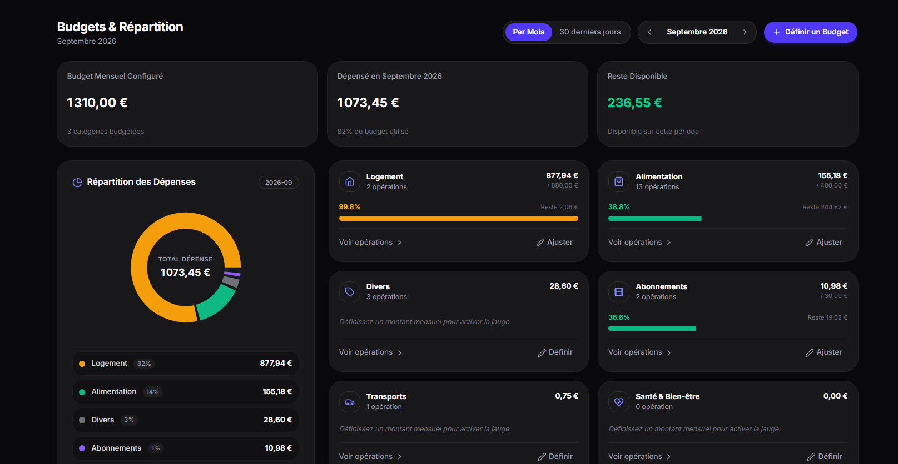

# Finly

Finly is a modern, self-hosted personal finance management progressive web app (PWA) designed with a privacy-first architecture. It combines automated bank synchronization, envelope budgeting, net worth tracking, and transaction classification in an ultra-clean, OLED-inspired dark interface.

<p align="center">
  
</p>

---

## Table of Contents

- [Overview](#overview)
- [Key Features](#key-features)
- [Technology Stack](#technology-stack)
- [Prerequisites](#prerequisites)
- [Quick Start with Docker](#quick-start-with-docker)
- [Manual Setup for Development](#manual-setup-for-development)
  - [Backend Setup (FastAPI)](#backend-setup-fastapi)
  - [Frontend Setup (Next.js)](#frontend-setup-nextjs)
- [User Guide and Workflow](#user-guide-and-workflow)
- [Environment Variables](#environment-variables)
- [Banking Connectors (Woob)](#banking-connectors-woob)
- [Security and Data Privacy](#security-and-data-privacy)
- [Project Structure](#project-structure)
- [License](#license)

---

## Overview

Finly is built for individuals who want complete control over their financial data without relying on third-party SaaS cloud platforms.

- **100% Self-Hosted & Private:** All account details, credentials, and transactions remain strictly on your local machine or server.
- **Direct Bank Sync:** Automated data retrieval via Woob without intermediaries or external aggregators.
- **Minimalist Aesthetic:** Focused interface inspired by Linear and Apple, featuring pure dark mode, clean typography, and zero unnecessary visual clutter.

---

## Key Features

### 1. Net Worth and Asset Tracking
- Consolidated real-time calculation of your total net worth.
- Breakdown across checking accounts, savings, investments, and real estate assets.
- One-click privacy mode to mask account balances.
- Historical net worth evolution and monthly trajectory charts.

### 2. Envelope Budgeting
- Category-based monthly budget envelopes with configurable spending targets.
- Real-time tracking of consumed amounts and remaining disposable funds.
- Progress bars and overspending warnings.

### 3. Transaction Management and Auto-Categorization
- Filter transactions by day, month, or custom date ranges.
- Automated normalization and cleanup of raw bank transaction labels.
- Dynamic rule-based category matcher based on keywords.
- Detailed transaction drawer for manual categorization and notes.

### 4. Savings Goals and Projects
- Custom savings goals with target amounts and deadlines.
- Associate specific transactions or savings accounts with active projects.
- Visual milestone indicators and remaining balance tracking.

### 5. Bank Aggregation Engine
- Direct connection to hundreds of European banks using open-source Woob modules.
- Scheduled background synchronization jobs via APScheduler.
- AES-256 (Fernet) symmetric encryption for all stored banking credentials.

### 6. Dynamic Excel Export
- Generate structured `.xlsx` workbooks with native Excel formulas (`SUM`, `SUMIF`).
- Dedicated tabs for executive summary, granular transactions, and category breakdowns.

### 7. Administration Panel and User Impersonation
- Dedicated administrative dashboard (`/admin`) with real-time system metrics (active users, connected banks, total volume, SQLite database size, scheduler status).
- User management tools (role assignment, account activation/deactivation, password reset, and cascading deletion).
- One-click user impersonation mode allowing administrators to view and navigate any user's dashboard.
- System maintenance utilities (manual global bank synchronization, SQLite `VACUUM` compaction).

---

## Technology Stack

### Frontend
- **Framework:** Next.js 16 (App Router, React 19, TypeScript)
- **Styling:** Tailwind CSS, custom Shadcn UI / Radix UI components
- **Charts:** Recharts, Lucide Icons
- **Export Engine:** xlsx, xlsx-js-style

### Backend
- **API Framework:** FastAPI (Python 3.11+)
- **Database:** SQLite with SQLAlchemy ORM
- **Authentication:** JWT (JSON Web Tokens) with bcrypt password hashing
- **Data Protection:** Cryptography (AES-256 Fernet)
- **Banking Driver:** Woob (Web Outside of Browsers)
- **Task Scheduler:** APScheduler

### Infrastructure
- Multi-container architecture via Docker and Docker Compose with persistent volumes.

---

## Prerequisites

Ensure the following tools are installed on your environment:

- **Docker Approach (Recommended):**
  - Docker Engine 20.10+
  - Docker Compose 2.0+
- **Manual Development Approach:**
  - Node.js 20+ and npm
  - Python 3.11+ and pip

---

## Quick Start with Docker

The fastest way to deploy Finly in a local or self-hosted production environment.

### 1. Clone the repository
```bash
git clone https://github.com/louislefo/Finly.git
cd Finly
```

### 2. Configure backend environment
Copy the template configuration:
```bash
cp backend/.env.example backend/.env
```

Generate a secure secret key:
```bash
python -c "import secrets; print(secrets.token_hex(32))"
```
Paste this value into `SECRET_KEY` inside `backend/.env`.

### 3. Build and launch containers
```bash
docker compose up -d --build
```

### 4. Access the application
- Web Application: [http://localhost:3000](http://localhost:3000)
- REST API Interactive Docs (Swagger UI): [http://localhost:8000/docs](http://localhost:8000/docs)
- Health Check: [http://localhost:8000/health](http://localhost:8000/health)

**Default Administrator Account:**
- **Identifier:** `admin` (or `admin@finly.local`)
- **Password:** `admin`

> [!NOTE]
> The default administrator account is automatically initialized upon the first startup. You can change its password or create additional administrator accounts directly from the Administration panel (`/admin`) or using the CLI.

### 5. Stop containers
```bash
docker compose down
```

---

## Manual Setup for Development

If you wish to contribute or develop locally without Docker:

### Backend Setup (FastAPI)

1. Open a terminal and navigate to the backend directory:
   ```bash
   cd backend
   ```

2. Create and activate a Python virtual environment:
   ```bash
   # On Linux / macOS
   python3 -m venv .venv
   source .venv/bin/activate

   # On Windows (PowerShell)
   python -m venv .venv
   .\.venv\Scripts\Activate.ps1
   ```

3. Install required Python packages:
   ```bash
   pip install -r requirements.txt
   ```

4. Create your local environment configuration:
   ```bash
   cp .env.example .env
   ```

5. Start the FastAPI development server with hot-reload:
   ```bash
   uvicorn app.main:app --reload --host 0.0.0.0 --port 8000
   ```

### Frontend Setup (Next.js)

1. Open a second terminal and navigate to the frontend directory:
   ```bash
   cd finly-app
   ```

2. Install Node dependencies:
   ```bash
   npm install
   ```

3. Start the Next.js development server:
   ```bash
   npm run dev
   ```

4. Open [http://localhost:3000](http://localhost:3000) in your browser.

---

## User Guide and Workflow

### Step 1: Initial Setup & Account Creation
- Open [http://localhost:3000](http://localhost:3000) and sign in using the default superuser credentials (`admin` / `admin`).
- Alternatively, register a new personal account or create and promote administrators directly from the Administration panel (`/admin`).
- All subsequent sessions use secure JWT tokens stored client-side.

### Step 2: Connecting Bank Accounts or Manual Entry
- Navigate to the **Accounts** section.
- **Automated Sync:** Select your banking institution from the Woob connector catalog, enter your credentials, and validate any multi-factor authentication (MFA) prompts.
- **Manual Accounts:** Create offline checking, savings, or investment accounts and record manual balances.
- **Real Estate:** Add real estate properties to include property value and remaining loan balances in your net worth calculation.

### Step 3: Setting Up Monthly Budgets
- Navigate to the **Budget** tab.
- Define monthly spending envelopes for your primary expense categories (e.g., Housing, Groceries, Transport, Subscriptions).
- Review progress bars and remaining allowances throughout the month.

### Step 4: Reviewing and Categorizing Expenses
- Check the **Expenses / Transactions** section to inspect recent transactions synced from your accounts.
- Set up automatic categorization rules to match transaction descriptions with target categories.
- Manually edit any transaction details or notes as needed.

### Step 5: Tracking Savings Goals & Projects
- Go to the **Projects** tab.
- Define short-term or long-term financial targets (e.g., Emergency Fund, Vacation, Down Payment).
- Track funding percentages and allocate capital towards your milestones.

### Step 6: Exporting Reports
- Export your consolidated financial history into Excel (`.xlsx`) workbooks containing native formulas for bookkeeping or tax preparation.

---

## Environment Variables

The backend configuration is managed through environment variables located in `backend/.env`.

| Variable | Description | Default Value |
| :--- | :--- | :--- |
| `DATABASE_URL` | SQLAlchemy connection string for SQLite database | `sqlite:///./finly.db` |
| `SECRET_KEY` | Secret key used for JWT signing and AES-256 credential encryption | Required |
| `CORS_ORIGINS` | Permitted origins for Cross-Origin Resource Sharing | `http://localhost:3000` |
| `SYNC_INTERVAL_HOURS` | Frequency of automated background bank synchronizations (in hours) | `6` |

---

## Banking Connectors (Woob)

Finly relies on the open-source Woob engine to communicate directly with banking APIs and portals.

### Updating Bank Connector Modules
Because banking web interfaces change over time, keep connector modules up to date:
```bash
woob config update
```

### Listing Supported Institutions
```bash
woob bank
```

---

## Security and Data Privacy

1. **Zero External Telemetry:** Finly never transmits financial data, account numbers, or credentials to external servers.
2. **Encrypted Credentials:** Bank connection credentials and authentication tokens stored in the database are encrypted with symmetric AES-256 encryption (Fernet).
3. **Password Security:** User authentication passwords are protected using industry-standard bcrypt hashes.
4. **Data Ownership:** You maintain full ownership over your database. Backups can be made by copying the SQLite database file.

---

## Project Structure

```text
Finly/
|-- backend/                     # FastAPI backend application
|   |-- app/
|   |   |-- api/                 # REST API routes (accounts, budgets, sync, etc.)
|   |   |-- core/                # Configuration, security, database models
|   |   |-- models/              # SQLAlchemy database entities
|   |   |-- scheduler/           # Background sync task scheduler
|   |   |-- services/            # Business logic (Woob engine, Excel export)
|   |   `-- main.py              # Application entrypoint
|   |-- Dockerfile               # Backend container configuration
|   |-- requirements.txt         # Python dependencies
|   `-- .env.example             # Environment template
|
|-- finly-app/                   # Next.js frontend application
|   |-- app/                     # App router pages (budget, compte, depenses, etc.)
|   |-- components/              # UI components (cards, dialogs, charts)
|   |-- hooks/                   # Custom React hooks
|   |-- lib/                     # API client and formatting utilities
|   |-- Dockerfile               # Frontend container configuration
|   `-- package.json             # Node.js dependencies
|
|-- Documents/                   # Documentation and visual assets
|   `-- images/
|       `-- Budget.png           # Dashboard and budget screenshot
|
|-- docker-compose.yml           # Multi-container orchestration
`-- README.md                    # Project documentation
```

---

## Contributing

Contributions, bug reports, and feature requests are welcome:

1. Fork the repository.
2. Create a dedicated branch: `git checkout -b feature/new-feature-name`.
3. Commit your changes: `git commit -m "Add new feature"`.
4. Push to the branch: `git push origin feature/new-feature-name`.
5. Open a Pull Request.

---

## License

This project is licensed under the MIT License. See the `LICENSE` file for details.