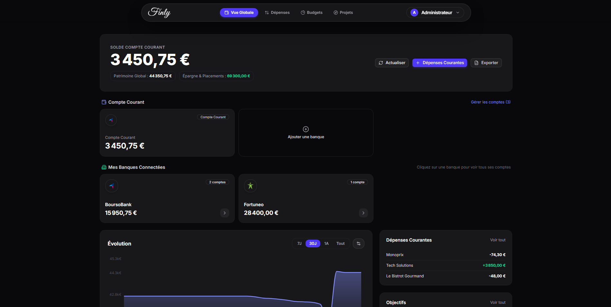
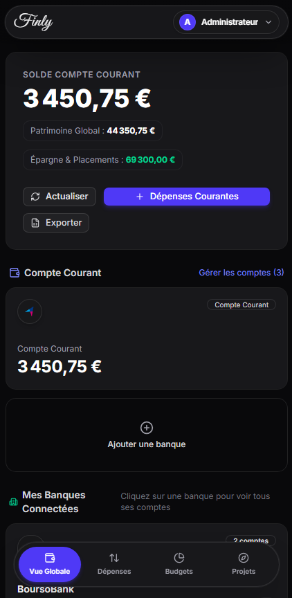
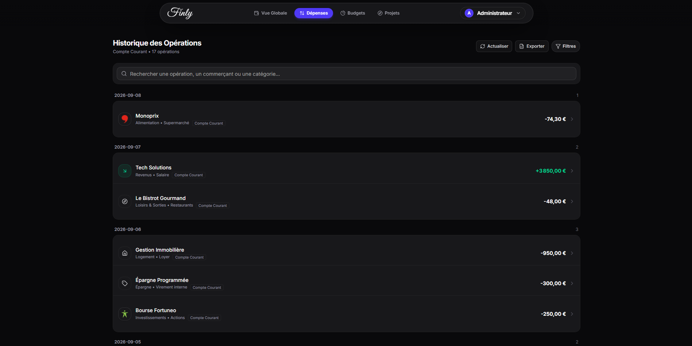
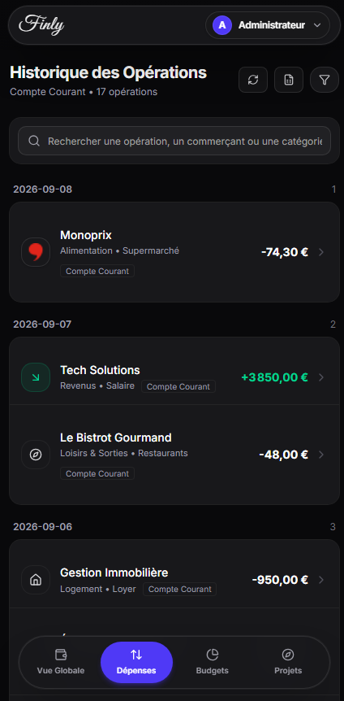
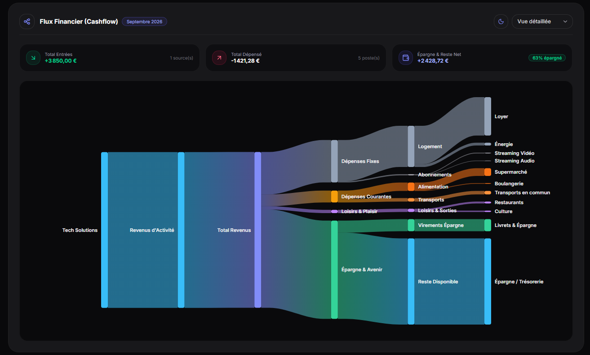
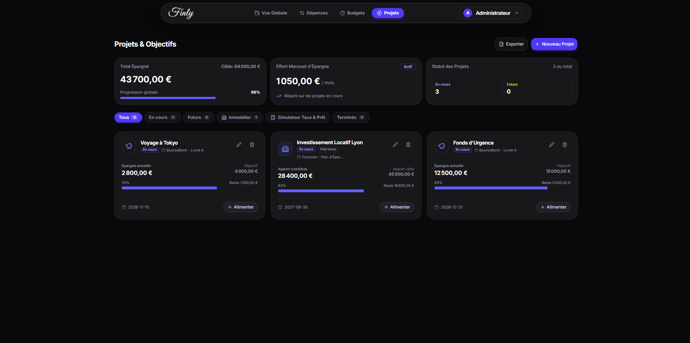
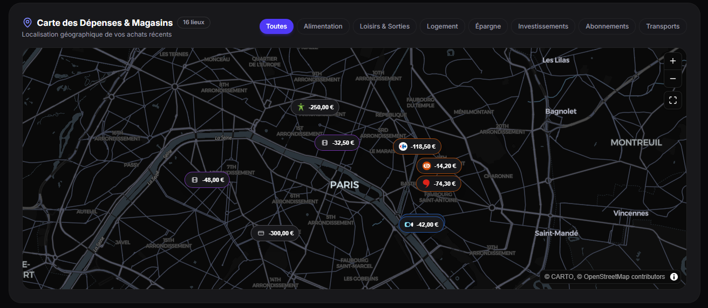

# Finly

Finly est une application web progressive (PWA) auto-hebergee de gestion des finances personnelles et du patrimoine, concue avec une architecture axee sur la confidentialite absolue. Elle combine synchronisation bancaire directe, budgetisation par enveloppes, suivi de la valeur nette en temps reel, analyse de flux de tresorerie et gestion de projets d'epargne dans une interface sombre et minimaliste inspiree d'Apple et Linear.

<p align="center">
  
</p>

---

## Sommaire

- [Apercu](#apercu)
- [Galerie et Interface](#galerie-et-interface)
- [Fonctionnalites Cles](#fonctionnalites-cles)
- [Stack Technologique](#stack-technologique)
- [Prerequis](#prerequis)
- [Demarrage Rapide avec Docker](#demarrage-rapide-avec-docker)
- [Installation Manuelle pour le Developpement](#installation-manuelle-pour-le-developpement)
  - [Backend FastAPI](#backend-fastapi)
  - [Frontend Nextjs](#frontend-nextjs)
- [Tests et Qualite](#tests-et-qualite)
- [Gestion des Connecteurs Bancaires Woob](#gestion-des-connecteurs-bancaires-woob)
- [Outils CLI d'Administration](#outils-cli-dadministration)
- [Securite et Protection des Donnees](#securite-et-protection-des-donnees)
- [Structure du Projet](#structure-du-projet)
- [Guide de Contribution](#guide-de-contribution)
- [Licence](#licence)

---

## Apercu

Finly s'adresse aux utilisateurs souhaitant reprendre le controle total de leurs donnees financieres sans dependre de services SaaS tiers ou de serveurs cloud externes.

- **100% Auto-Heberge et Prive :** Toutes les informations de compte, identifiants et transactions sont stockes localement dans votre base de donnees.
- **Synchronisation Bancaire Directe :** Recuperation automatisee des soldes et operations via le moteur open-source Woob, sans intermediaire payant ni aggregation distante.
- **Esthetique Minimaliste et Epuree :** Interface Dark Mode exclusive (Zinc 950 `#09090B`), concue pour afficher les chiffres cles et graphiques essentiels sans texte superflu.
- **Responsive et PWA :** Utilisation fluide sur grand ecran comme sur mobile avec navigation dediee.

---

## Galerie et Interface

### Vue Globale et Tableau de Bord

Tableau de bord centralisant le patrimoine total, la repartition par types de comptes (comptes courants, epargne, investissements, immobilier), l'evolution temporelle et le mode confidentialite.

| Version Desktop | Version Mobile |
| :--- | :--- |
|  |  |

---

### Suivi des Depenses et Transactions

Filtrage avance par periode (jour, mois, personnalise), categorisation intelligente et affichage optimise.

| Version Desktop | Version Mobile |
| :--- | :--- |
|  |  |

---

### Budgetisation par Enveloppes et Analyse des Flux

Controlez vos plafonds de depenses par categorie avec jauges de progression et analysez vos flux de tresorerie (entrees vs sorties).

| Budgetisation par Enveloppes | Flux de Tresorerie (Cashflow) |
| :--- | :--- |
|  |  |

---

### Projets d'Epargne et Gestion des Cartes

Fixez des objectifs financiers avec echeances et suivez les soldes par etablissement bancaire.

| Projets d'Epargne | Vue Cartes et Comptes |
| :--- | :--- |
|  |  |

---

## Fonctionnalites Cles

### 1. Suivi de Patrimoine et Valeur Nette
- Agregation en direct de la valeur nette globale.
- Prise en compte des comptes courants, livrets d'epargne, portefeuilles d'actifs et biens immobiliers (valeur du bien et capital restant du).
- Mode Confidentialite en un clic pour masquer l'ensemble des montants a l'ecran.
- Graphiques d'evolution historique et de trajectoire financiere.

### 2. Budgetisation Mensuelle par Enveloppes
- Enveloppes budgetaires configurables par categorie de depenses (Alimentation, Logement, Transports, Loisirs, etc.).
- Jauges de consommation en temps reel et alertes visuelles de depassement.
- Export PDF structure des budgets mensuels avec repartition graphique.

### 3. Gestion et Normalisation des Transactions
- Nettoyage automatique des libelles bruts de cartes et virements.
- Moteur de regles dynamiques pour l'auto-categorisation basee sur des mots-cles.
- Panneau lateral de modification detaillee (changement de categorie, notes, association a un projet).

### 4. Projets et Objectifs d'Epargne
- Creation d'objectifs avec montant cible, date butoir et indicateur de progression.
- Visualisation du montant restant a financer et des etapes atteintes.

### 5. Moteur d'Agregation Bancaire Locale (Woob)
- Connexion directe aux banques francaises et europeennes.
- Chiffrement symetrique AES-256 (Fernet) de tous les identifiants stockes.
- Planificateur integre (APScheduler) pour la synchronisation automatique en arriere-plan.

### 6. Exports Avances Excel et PDF
- Export de classeurs Excel (`.xlsx`) incluant des formules de calcul natives (`SUM`, `SUMIF`) et des onglets thematiques.
- Export de rapports budgetaires au format PDF avec tableaux et synthetiseurs visuels.

### 7. Administration et Maintenance
- Espace dedie `/admin` avec metriques systeme (utilisateurs, connexions bancaires, taille de la base SQLite, statut du scheduler).
- Gestion complete des comptes utilisateurs (activation, reinitialisation de mot de passe, suppression en cascade).
- Mode Impersonation permettant a l'administrateur de diagnostiquer l'espace d'un utilisateur en un clic.
- Outils de maintenance : synchronisation globale forcee et compactage de base (`VACUUM`).

---

## Stack Technologique

### Frontend
- **Framework :** Next.js 16 (App Router, React 19, TypeScript)
- **Style :** Tailwind CSS v4, composants Shadcn UI et Radix UI
- **Graphiques :** Recharts, Lucide Icons
- **Export :** xlsx, xlsx-js-style, jspdf

### Backend
- **Framework API :** FastAPI (Python 3.11+)
- **Base de donnees :** SQLite avec SQLAlchemy ORM
- **Authentification :** JWT (JSON Web Tokens) avec hachage bcrypt
- **Chiffrement :** Cryptography (AES-256 Fernet)
- **Moteur Bancaire :** Woob (Web Outside of Browsers)
- **Taches de fond :** APScheduler

### Deploiement & Outils
- **Conteneurisation :** Docker, Docker Compose
- **Tests :** Pytest (backend), Vitest & Testing Library (frontend)

---

## Prerequis

- **Approche Docker (Recommandee) :**
  - Docker Engine 20.10+
  - Docker Compose 2.0+
- **Approche Developpement Manuel :**
  - Node.js 20+ et npm
  - Python 3.11+ et pip

---

## Demarrage Rapide avec Docker

Le moyen le plus simple et robuste de deployer Finly sur une machine locale ou un serveur personnel.

### 1. Cloner le depot
```bash
git clone https://github.com/louislefo/Finly.git
cd Finly
```

### 2. Configurer les variables du backend
Copier le fichier d'exemple :
```bash
cp backend/.env.example backend/.env
```

Generer une cle secrete securisee :
```bash
python -c "import secrets; print(secrets.token_hex(32))"
```
Renseigner cette valeur dans `SECRET_KEY` a l'interieur du fichier `backend/.env`.

### 3. Lancer les conteneurs
```bash
docker compose up -d --build
```

### 4. Acceder a l'application
- **Interface Web :** [http://localhost:3000](http://localhost:3000)
- **Documentation API (Swagger UI) :** [http://localhost:8000/docs](http://localhost:8000/docs)
- **Verification de sante :** [http://localhost:8000/health](http://localhost:8000/health)

**Compte Administrateur Initial :**
- Identifiant : `admin` (ou `admin@finly.local`)
- Mot de passe : `admin`

*Note : Le compte administrateur est cree automatiquement au premier lancement. Vous pouvez modifier ses identifiants depuis le panneau `/admin` ou via la CLI.*

### 5. Arreter les conteneurs
```bash
docker compose down
```

---

## Installation Manuelle pour le Developpement

### Backend FastAPI

1. Se positionner dans le repertoire backend :
   ```bash
   cd backend
   ```

2. Creer et activer un environnement virtuel Python :
   ```bash
   # Sur Linux / macOS
   python3 -m venv .venv
   source .venv/bin/activate

   # Sur Windows (PowerShell)
   python -m venv .venv
   .\.venv\Scripts\Activate.ps1
   ```

3. Installer les dependances Python :
   ```bash
   pip install -r requirements.txt
   ```

4. Preparer la configuration locale :
   ```bash
   cp .env.example .env
   ```

5. Demarrer le serveur backend avec rechargement a chaud :
   ```bash
   uvicorn app.main:app --reload --host 0.0.0.0 --port 8000
   ```

---

### Frontend Next.js

1. Ouvrir un second terminal et se positionner dans le dossier frontend :
   ```bash
   cd finly-app
   ```

2. Installer les modules Node.js :
   ```bash
   npm install
   ```

3. Lancer le serveur de developpement :
   ```bash
   npm run dev
   ```

4. Ouvrir [http://localhost:3000](http://localhost:3000) dans votre navigateur.

---

## Tests et Qualite

### Tests Backend (Pytest)
```bash
cd backend
pytest -v
```

### Tests Frontend (Vitest)
```bash
cd finly-app
npm test
```

### Verification du Lint Frontend
```bash
cd finly-app
npm run lint
```

---

## Gestion des Connecteurs Bancaires Woob

Finly exploite la suite d'outils Woob pour communiquer avec les interfaces des etablissements bancaires.

### Mettre a jour les modules bancaires
Les interfaces bancaires evoluant regulierement, il est conseille de maintenir les modules a jour :
```bash
woob config update
```

### Lister les banques supportees
```bash
woob bank
```

---

## Outils CLI d'Administration

Le backend dispose d'un outil en ligne de commande pour la gestion rapide des comptes administrateurs et des utilisateurs sans passer par l'interface web :

### Creer un compte administrateur
```bash
python -m app.cli create-admin --email admin@domaine.local --password MonMotDePasseFort --name "Admin Principal"
```

### Promouvoir un utilisateur existant
```bash
python -m app.cli promote-admin --email utilisateur@domaine.local
```

### Lister l'ensemble des utilisateurs
```bash
python -m app.cli list-users
```

### Reinitialiser le mot de passe d'un compte
```bash
python -m app.cli reset-password --email utilisateur@domaine.local --password NouveauMotDePasse
```

---

## Securite et Protection des Donnees

1. **Zero Telemetrie Externe :** Aucune donnee financiere ou information d'utilisation n'est transmise vers des serveurs tiers.
2. **Chiffrement Symetrique AES-256 :** Les identifiants bancaires et jetons d'acces stockes en base sont chiffres avec Fernet (AES-256-CBC et HMAC-SHA256).
3. **Protection des Mots de Passe :** Tous les mots de passe utilisateurs sont haches a l'aide de bcrypt avec un sel unique.
4. **Controle Total de la Persistance :** Votre base SQLite reste entierement locale. Les sauvegardes consistent simplement a copier le fichier de base de donnees.

---

## Structure du Projet

```text
Finly/
|-- backend/                     # Application API FastAPI (Python)
|   |-- app/
|   |   |-- api/                 # Endpoints REST (auth, accounts, budgets, sync, admin)
|   |   |-- core/                # Configuration, securite, base de donnees
|   |   |-- models/              # Entites SQLAlchemy
|   |   |-- scheduler/           # Taches de synchronisation planifiees
|   |   |-- services/            # Moteur Woob, export Excel & PDF
|   |   |-- cli.py               # Outil de commande d'administration
|   |   `-- main.py              # Point d'entree FastAPI
|   |-- tests/                   # Suite de tests Pytest
|   |-- Dockerfile               # Image Docker backend
|   |-- requirements.txt         # Dependances Python
|   `-- .env.example             # Gabarit des variables d'environnement
|
|-- finly-app/                   # Application frontend Next.js 16 (App Router)
|   |-- app/                     # Pages et routes (dashboard, budget, depenses, admin)
|   |-- components/              # Composants UI Shadcn, graphiques, tiroirs et modales
|   |-- hooks/                   # Hooks React personnalises
|   |-- lib/                     # Client API, formatage, export PDF
|   |-- __tests__/               # Suite de tests Vitest
|   |-- Dockerfile               # Image Docker frontend
|   `-- package.json             # Dependances et scripts Node.js
|
|-- Documents/                   # Documentation et ressources visuelles
|   `-- images/                  # Captures d'ecran de l'application
|
|-- docker-compose.yml           # Orchestration multi-conteneurs
|-- CONTRIBUTING.md              # Guide complet pour contribuer au projet
|-- commandes.md                 # Aide-memoire des commandes frequentes
`-- README.md                    # Documentation generale
```

---

## Guide de Contribution

Les contributions au projet sont les bienvenues. Pour connaitre les regles de developpement, les conventions de code et la procedure de soumission de Pull Requests, veuillez consulter le fichier [CONTRIBUTING.md](CONTRIBUTING.md).

---

## Licence

Ce projet est distribue sous licence MIT. Consultez le fichier `LICENSE` pour plus de details.