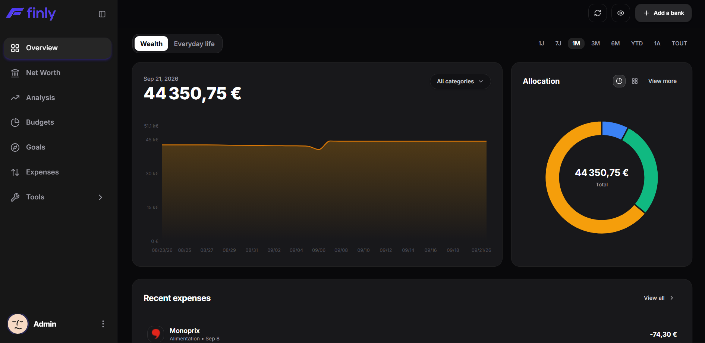

<p align="center">
  
</p>

<p align="center">
  <b>Self-Hosted, Privacy-First Personal Wealth & Financial Operations Platform</b>
</p>

<p align="center">
  
  
  
  
  
  
  
</p>

---

Finly is an autonomous, self-hosted progressive web application (PWA) designed for complete privacy and total control over personal finances, bank accounts, investments, and net worth. Built with an exclusive Dark Mode aesthetic inspired by Linear and Apple, Finly eliminates third-party SaaS dependencies, fees, and telemetry.

<p align="center">
  
</p>

---

## Table of Contents

- [Core Principles](#core-principles)
- [Key Features](#key-features)
- [Architecture & Tech Stack](#architecture--tech-stack)
- [Prerequisites](#prerequisites)
- [Quick Start with Docker](#quick-start-with-docker)
- [Manual Development Setup](#manual-development-setup)
- [API Endpoints Reference](#api-endpoints-reference)
- [Testing & Quality Assurance](#testing--quality-assurance)
- [CLI Administration Utilities](#cli-administration-utilities)
- [Security & Encryption Architecture](#security--encryption-architecture)
- [Project Structure](#project-structure)
- [Contributing](#contributing)
- [License](#license)

---

## Core Principles

- **Complete Data Sovereignty:** Account credentials, transaction ledgers, bank connections, and analytics are stored locally on your own machine or private server.
- **Direct Bank Synchronization:** Automated, direct bank synchronization powered by the open-source Woob engine, operating without paid intermediaries or remote cloud collectors.
- **Minimalist OLED Interface:** Dark Mode UI (Zinc 950 `#09090B` background, `#18181B` surfaces, subtle `border-white/10`) engineered for clarity and immediate comprehension.
- **Precision Financial Modeling:** Live market quotes, real-time index feeds, compound interest simulators, and automated recurring subscription detection.

---

## Key Features

### 1. Global Stock Market & Equities Hub
- Real-time quote tracking for major world market indices (CAC 40, S&P 500, Nasdaq 100, DAX 40, Euro Stoxx 50) and global stocks.
- High-precision interactive area charts with authentic historical data across 1D (5-minute intraday ticks), 1W, 1M, 1Y, 5Y, and MAX horizons.
- Intelligent multi-criteria search supporting French and English semantic keywords (e.g., *voiture*, *ia*, *luxe*, *pétrole*, *chips*, *spacex*, *satellites*) with instant floating preview popovers.
- High-resolution brand logo resolution system with fallback monograms.

### 2. Net Worth & Multi-Institution Aggregation
- Multi-asset consolidation: Checking accounts, savings books, stock brokerage portfolios, life insurance policies, crypto assets, and real estate properties (property valuation, down payment, and remaining mortgage balance).
- Real-time portfolio PnL, PRU (average purchase price), asset allocation by class, and sector diversification breakdown.
- Privacy Mode: Mask all monetary values with a single click across the entire interface without layout disruption.

### 3. Automated Bank Synchronization & Reconciliation
- Direct synchronization with European and international banks via the Woob connector engine.
- Intelligent transaction deduplication, reconciliation, and balance continuity.
- In-browser CSV file import parser supporting standard bank exports.
- Background synchronization scheduler (APScheduler) with configurable refresh intervals.

### 4. Expense Ledger & Auto-Categorization
- Dynamic keyword rule engine that normalizes raw bank descriptors and automatically assigns categories.
- Side drawer transaction inspector for rapid updates, subcategories, custom notes, and project linking.
- Date range filtering, category distribution breakdowns, and merchant frequency analysis.

### 5. Envelope Budgeting & Runway Analysis
- Configurable monthly budget envelopes per spending category with real-time consumption progress gauges.
- 50/30/20 budget framework compliance diagnostics and financial runway calculation (months of survival without income).
- Professional PDF budget report generation and multi-tab Excel (`.xlsx`) export with native spreadsheet formulas (`SUM`, `SUMIF`).

### 6. Subscriptions Hub & Recurring Cost Detector
- Automated time-series detection of recurring debits across multi-month transaction histories.
- Monthly and annual recurring burn rate aggregation with renewal calendar alerts.

### 7. Administration & Maintenance Console
- Dedicated `/admin` control dashboard monitoring user counts, active bank connections, SQLite database file size, and background worker health.
- User management: account activation, password resets, role promotions, and database compaction (`VACUUM`).

---

## Architecture & Tech Stack

```text
+-------------------------------------------------------------------------+
|                              Next.js 16                                 |
|          App Router, React 19, TypeScript, Tailwind CSS, Shadcn UI      |
+------------------------------------+------------------------------------+
                                     |
                         HTTP / REST | (JWT Auth)
                                     v
+------------------------------------+------------------------------------+
|                           FastAPI Backend                               |
|              Python 3.11+, Pydantic V2, SQLAlchemy, Uvicorn             |
+------------------+-----------------+-------------------+----------------+
                   |                 |                   |
                   v                 v                   v
            +--------------+  +--------------+   +---------------+
            |    SQLite    |  |  Woob Engine |   | Yahoo Finance |
            |  (SQLAlchemy)|  | (Bank Sync)  |   | (Market Data) |
            +--------------+  +--------------+   +---------------+
```

### Frontend
- **Framework:** Next.js 16 (App Router, React 19, TypeScript)
- **Styling & Components:** Tailwind CSS, Shadcn UI, Radix UI Primitives
- **Data Visualization:** Recharts, Lucide Icons
- **Document Engines:** xlsx, xlsx-js-style, jspdf

### Backend
- **Framework:** FastAPI (Python 3.11+)
- **Database Engine:** SQLite with SQLAlchemy ORM
- **Authentication:** JWT (JSON Web Tokens) with salted bcrypt password hashing
- **Security & Cryptography:** AES-256 Fernet symmetric encryption
- **Banking Driver:** Woob (Web Outside of Browsers)
- **Task Scheduling:** APScheduler

---

## Prerequisites

### Docker Approach (Recommended)
- Docker Engine 20.10+
- Docker Compose 2.0+

### Manual Development Approach
- Node.js 20+ and npm
- Python 3.11+ and pip

---

## Quick Start with Docker

```bash
# 1. Clone repository
git clone https://github.com/louislefo/Finly.git
cd Finly

# 2. Configure environment
cp backend/.env.example backend/.env

# 3. Launch containers
docker compose up -d --build
```

Access points:
- Web Interface: [http://localhost:3000](http://localhost:3000)
- REST API Documentation (Swagger UI): [http://localhost:8000/docs](http://localhost:8000/docs)
- Health Check: [http://localhost:8000/health](http://localhost:8000/health)

Default initial administrator credentials:
- Username: `admin` (or `admin@finly.local`)
- Password: `admin`

---

## Manual Development Setup

### Backend (FastAPI)

```bash
cd backend

# Virtual environment setup
python -m venv .venv

# Activate environment (Linux / macOS)
source .venv/bin/activate
# Activate environment (Windows PowerShell)
.\.venv\Scripts\Activate.ps1

# Install dependencies
pip install -r requirements.txt

# Configure environment
cp .env.example .env

# Run development server
uvicorn app.main:app --reload --host 0.0.0.0 --port 8000
```

### Frontend (Next.js)

```bash
cd finly-app

# Install dependencies
npm install

# Run development server
npm run dev
```

Open [http://localhost:3000](http://localhost:3000) in your browser.

---

## API Endpoints Reference

| Module | Method | Endpoint | Description |
| :--- | :--- | :--- | :--- |
| **Auth** | `POST` | `/api/v1/auth/login` | Authenticate user and issue JWT bearer token |
| **Auth** | `GET` | `/api/v1/auth/me` | Fetch authenticated user profile and permissions |
| **Accounts** | `GET` | `/api/v1/accounts` | List aggregated bank and manual accounts |
| **Accounts** | `POST` | `/api/v1/accounts` | Create a new manual bank or asset account |
| **Transactions**| `GET` | `/api/v1/transactions` | Query and filter transaction ledger |
| **Investments** | `GET` | `/api/v1/investments/indices` | Real-time global market indices quotes |
| **Investments** | `GET` | `/api/v1/investments/stocks` | Search stocks and ETFs with semantic matching |
| **Investments** | `GET` | `/api/v1/investments/stocks/{symbol}/history` | High-precision chart candles (1D, 1W, 1M, 1Y, 5Y, ALL) |
| **Investments** | `GET` | `/api/v1/investments/holdings` | Portfolio holdings with PRU and valuation |
| **Budgets** | `GET` | `/api/v1/budgets` | Fetch monthly envelope budgets and consumption |
| **Woob Sync** | `POST` | `/api/v1/sync/trigger` | Trigger immediate banking connector refresh |
| **Admin** | `GET` | `/api/v1/admin/stats` | System metrics, database size, and scheduler state |
| **Admin** | `POST` | `/api/v1/admin/maintenance/vacuum` | Execute SQLite database compaction |

---

## Testing & Quality Assurance

```bash
# Run backend test suite (Pytest)
cd backend
pytest -v

# Run frontend test suite (Vitest)
cd finly-app
npm test

# Run frontend production build validation
cd finly-app
npm run build
```

---

## CLI Administration Utilities

The backend provides a command-line interface for administrative operations:

```bash
# Create an administrator
python -m app.cli create-admin --email admin@domain.local --password StrongPassword123 --name "Admin"

# Promote existing user
python -m app.cli promote-admin --email user@domain.local

# List all users
python -m app.cli list-users

# Reset user password
python -m app.cli reset-password --email user@domain.local --password NewPassword123
```

---

## Security & Encryption Architecture

1. **Zero External Telemetry:** All accounts, financial figures, transaction descriptions, and encryption keys remain exclusively on your host.
2. **AES-256 Symmetric Encryption:** Banking credentials and access tokens are encrypted with Fernet (AES-256-CBC with HMAC-SHA256 authentication).
3. **Password Security:** User authentication uses salted bcrypt password hashing with configurable complexity rounds.
4. **Isolated Storage:** SQLite database runs locally in your volume; full backups consist of copying the `.db` file.

---

## Project Structure

```text
Finly/
|-- backend/                     # FastAPI REST API (Python)
|   |-- app/
|   |   |-- api/                 # Endpoints (auth, accounts, investments, budgets, sync, admin)
|   |   |-- core/                # Configuration, security, database engine
|   |   |-- models/              # SQLAlchemy database models
|   |   |-- scheduler/           # Automated background sync worker
|   |   |-- services/            # Market data service, Woob engine, Excel & PDF exporters
|   |   |-- cli.py               # Administrative CLI tool
|   |   `-- main.py              # FastAPI application entrypoint
|   |-- tests/                   # Pytest test suite (36 tests)
|   |-- Dockerfile               # Backend container definition
|   `-- requirements.txt         # Python dependencies
|
|-- finly-app/                   # Next.js 16 frontend (App Router)
|   |-- app/                     # Next.js routes (overview, wealth, analysis, budget, stocks, admin)
|   |-- components/              # Shadcn UI components, Recharts visualizations, drawers
|   |-- hooks/                   # React hooks (privacy, language, auth)
|   |-- lib/                     # API clients, formatters, i18n dictionaries, types
|   |-- __tests__/               # Vitest test suite (54 tests)
|   |-- Dockerfile               # Frontend container definition
|   `-- package.json             # Node.js dependencies and scripts
|
|-- Documents/                   # Documentation and project resources
|   `-- images_v2/               # High-resolution application preview
|
|-- docker-compose.yml           # Multi-container service specification
|-- CONTRIBUTING.md              # Contribution standards and guidelines
`-- README.md                    # Project documentation
```

---

## Contributing

Contributions are welcome. Please refer to [CONTRIBUTING.md](CONTRIBUTING.md) for architecture guidelines, code formatting standards, and pull request procedures.

---

## License

This project is licensed under the MIT License. See the `LICENSE` file for details.